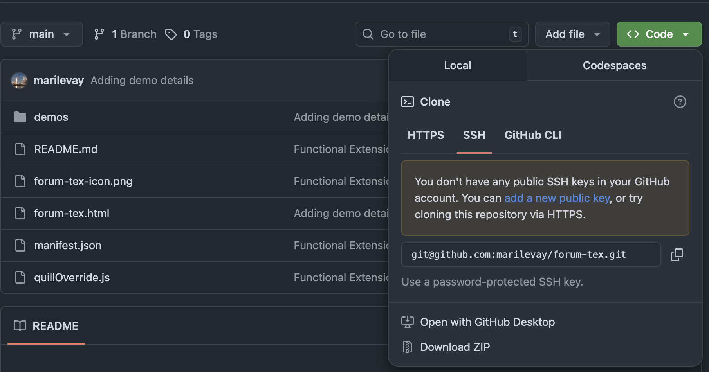
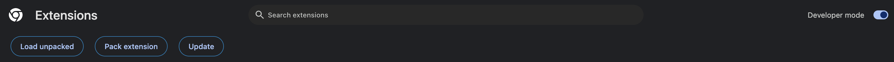
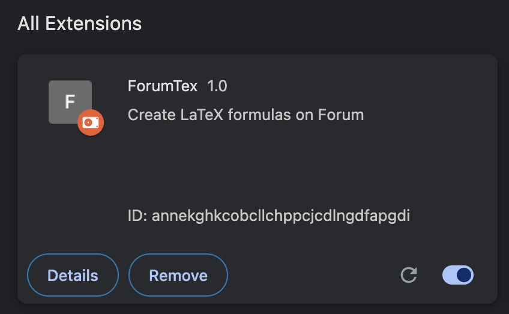
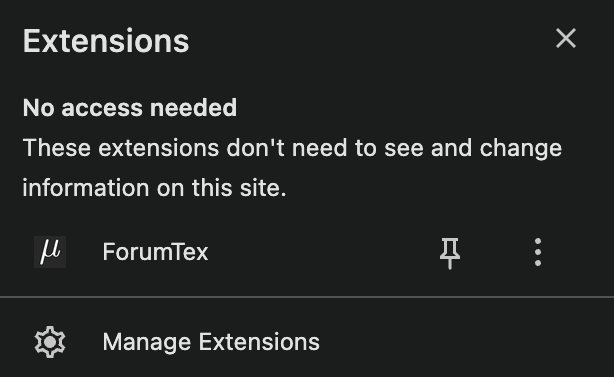
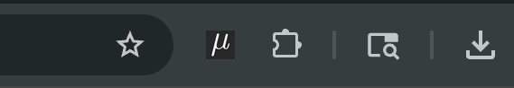

# ForumTex
Finally adding the LaTeX feature for the Forum text editor. 

## How to install 

* Download this repo as a .zip file

* Access `chrome://extensions` and enable Developer Mode and click on "Load Unpacked:

* Select the unzipped folder. This extension should open to you:

* Make sure to pin the extension so it's always available at your extension bar:

* Now you can access ForumTex on your extension bar:

## Usage and Limitations

Instructions are included on the extension. If there are any use issues feel free to hit me a message on the Minerva group chats. 

This project is licensed under the MIT License. See the LICENSE file for details.